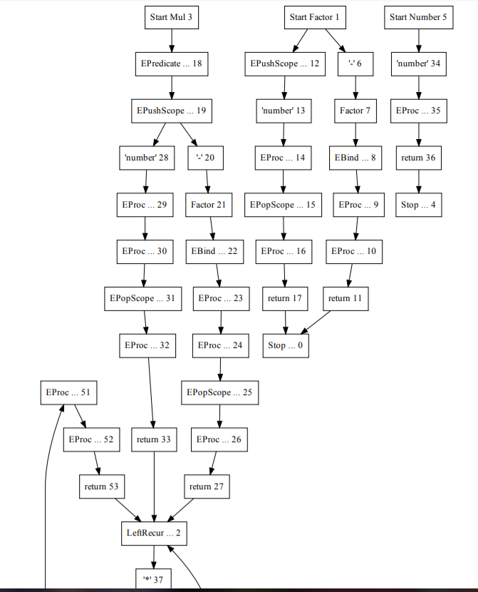

# RBNF

## Usage

```
RBNF -in <input json filename>
     [-aeson <output json filename>]

     # pretty print generated ir:
     [-dump]
     # look ahead k
     -k int
     # to specify if traceback supported(with a little performance cost)
     [-trace]
```

## Note: Front End
```haskell
infix 5 -->
infix 6 |=

number = "number"
negation = "-"
multiply = "*"

a |= b = CBind a b

a --> b = (a, b, Nothing)
case' a = CTerm (Case a)
parsers = S.fromList [
    "Number"   --> case' number
    , "Factor" --> CAlt [
            CNonTerm "Number",
            CSeq [case' negation, "a" |= CNonTerm "Factor" ]
        ]
    , "Mul"    --> CAlt [
            CSeq [ CPred (MTerm "somePred"), CNonTerm "Factor" ],
            CSeq [ CNonTerm "Mul", case' multiply, CNonTerm "Factor"]
        ]
    ]
```

## Note: Analyses

Left recursion handling, lookahead decision trees, etc.

- Left recursion handling:



- Lookahed decision trees(by ID3 algorithm)

```
======== Node1 ========
  LAShift (Case "-")
      LAShift (Case "-")
          LAShift (Case "-")
              [6]
          LAShift (Case "number")
              [6]
      LAShift (Case "number")
          [6]
  LAShift (Case "number")
      [12]
--- LA optimization:
case elts[0]
      LAShift (Case "-") => [6]
      LAShift (Case "number") => [12]

======== Node19 ========
  LAShift (Case "-")
      LAShift (Case "-")
          LAShift (Case "-")
              [20]
          LAShift (Case "number")
              [20]
      LAShift (Case "number")
          LAShift (Case "*")
              [20]
  LAShift (Case "number")
      LAShift (Case "*")
          LAShift (Case "-")
              [28]
          LAShift (Case "number")
              [28]
--- LA optimization:
case elts[1]
      LAShift (Case "*") => [28]
      LAShift (Case "-") => [20]
      LAShift (Case "number") => [20]

======== Node38 ========
  LAShift (Case "-")
      LAShift (Case "-")
          LAShift (Case "-")
              [39]
          LAShift (Case "number")
              [39]
      LAShift (Case "number")
          LAShift (Case "*")
              [39]
  LAShift (Case "number")
      LAShift (Case "*")
          [48]
--- LA optimization:
case elts[1]
      LAShift (Case "*") => [48]
      LAShift (Case "-") => [39]
      LAShift (Case "number") => [39]
```

## Note: Code Generation

```
def parse.Mul(%state, %tokens)
    if somePred
    then if %peekable_n(%tokens, 1)
         then switch %peek_n(%tokens, 1).idint
              case 2 : %off =  %tokens.offset
                       .slot.0 =  %match_token(%tokens, 1)
                       if %==(.slot.0, %null)
                       then tuple( 0
                            , %cast_to_any(%cons(tuple(%off, "-"), %nil)) )
                       else %off =  %tokens.offset
                            .slot.1.check =  parse.Factor(%tokens, %state)
                            if %==(.slot.1[0], 0)
                            then .slot.1.check
                            else .slot.1 =  %cast_to_result(.slot.1.check[1])
                                 Mul.Factor.a.0 =  .slot.1
                                 .slot.-1 =  tuple(.slot.0, .slot.1)
                                 .slot.-2 =  %mk_ast("Factor", tuple(.slot.-1))
                                 .slot.-3 =  %mk_ast("Mul", tuple(.slot.-2))
                                 lr.Mul(.slot.-3, %state, %tokens)
              case 1 : %off =  %tokens.offset
                       .slot.0 =  %match_token(%tokens, 1)
                       if %==(.slot.0, %null)
                       then tuple( 0
                            , %cast_to_any(%cons(tuple(%off, "-"), %nil)) )
                       else %off =  %tokens.offset
                            .slot.1.check =  parse.Factor(%tokens, %state)
                            if %==(.slot.1[0], 0)
                            then .slot.1.check
                            else .slot.1 =  %cast_to_result(.slot.1.check[1])
                                 Mul.Factor.a.0 =  .slot.1
                                 .slot.-1 =  tuple(.slot.0, .slot.1)
                                 .slot.-2 =  %mk_ast("Factor", tuple(.slot.-1))
                                 .slot.-3 =  %mk_ast("Mul", tuple(.slot.-2))
                                 lr.Mul(.slot.-3, %state, %tokens)
              case 0 : %off =  %tokens.offset
                       .slot.0 =  %match_token(%tokens, 2)
                       if %==(.slot.0, %null)
                       then tuple( 0
                            , %cast_to_any(%cons(tuple(%off, "number"), %nil)) )
                       else .slot.-1 =  %mk_ast("Number", tuple(.slot.0))
                            .slot.-2 =  %mk_ast("Factor", tuple(.slot.-1))
                            .slot.-3 =  %mk_ast("Mul", tuple(.slot.-2))
                            lr.Mul(.slot.-3, %state, %tokens)
         else tuple(0, %cast_to_any(%nil))
    else tuple(0, %cast_to_any(%nil))
def lr.Mul(.slot.0, %state, %tokens)
    lr.Mul.try =
        %off =  %tokens.offset
        .slot.1 =  %match_token(%tokens, 0)
        if %==(.slot.1, %null)
        then tuple(0, %cast_to_any(%cons(tuple(%off, "*"), %nil)))
        else if %peekable_n(%tokens, 1)
             then switch %peek_n(%tokens, 1).idint
                  case 2 : %off =  %tokens.offset
                           .slot.2 =  %match_token(%tokens, 1)
                           if %==(.slot.2, %null)
                           then tuple( 0
                                , %cast_to_any(%cons(tuple(%off, "-"), %nil)) )
                           else %off =  %tokens.offset
                                .slot.3.check =  parse.Factor(%tokens, %state)
                                if %==(.slot.3[0], 0)
                                then .slot.3.check
                                else .slot.3 =  %cast_to_result(.slot.3.check[1])
                                     Mul.Factor.a.0 =  .slot.3
                                     .slot.-1 =  tuple(.slot.2, .slot.3)
                                     .slot.-2 =  %mk_ast("Factor",
                                                 tuple(.slot.-1))
                                     .slot.-3 =  tuple( .slot.0
                                                 , .slot.1
                                                 , .slot.-2 )
                                     .slot.-4 =  %mk_ast("Mul", tuple(.slot.-3))
                                     .slot.-4
                  case 1 : %off =  %tokens.offset
                           .slot.2 =  %match_token(%tokens, 1)
                           if %==(.slot.2, %null)
                           then tuple( 0
                                , %cast_to_any(%cons(tuple(%off, "-"), %nil)) )
                           else %off =  %tokens.offset
                                .slot.3.check =  parse.Factor(%tokens, %state)
                                if %==(.slot.3[0], 0)
                                then .slot.3.check
                                else .slot.3 =  %cast_to_result(.slot.3.check[1])
                                     Mul.Factor.a.0 =  .slot.3
                                     .slot.-1 =  tuple(.slot.2, .slot.3)
                                     .slot.-2 =  %mk_ast("Factor",
                                                 tuple(.slot.-1))
                                     .slot.-3 =  tuple( .slot.0
                                                 , .slot.1
                                                 , .slot.-2 )
                                     .slot.-4 =  %mk_ast("Mul", tuple(.slot.-3))
                                     .slot.-4
                  case 0 : %off =  %tokens.offset
                           .slot.2.check =  parse.Number(%tokens, %state)
                           if %==(.slot.2[0], 0)
                           then .slot.2.check
                           else .slot.2 =  %cast_to_result(.slot.2.check[1])
                                .slot.-1 =  %mk_ast("Factor", tuple(.slot.2))
                                .slot.-2 =  tuple(.slot.0, .slot.1, .slot.-1)
                                .slot.-3 =  %mk_ast("Mul", tuple(.slot.-2))
                                .slot.-3
             else tuple(0, %cast_to_any(%nil))
    while %!=(lr.Mul.try[0], 0)
        .slot.0 =  %cast_to_result(lr.Mul.try[1])
        lr.Mul.try =
            %off =  %tokens.offset
            .slot.1 =  %match_token(%tokens, 0)
            if %==(.slot.1, %null)
            then tuple(0, %cast_to_any(%cons(tuple(%off, "*"), %nil)))
            else if %peekable_n(%tokens, 1)
                 then switch %peek_n(%tokens, 1).idint
                      case 2 : %off =  %tokens.offset
                               .slot.2 =  %match_token(%tokens, 1)
                               if %==(.slot.2, %null)
                               then tuple( 0
                                    , %cast_to_any(%cons(tuple(%off, "-"),
                                                   %nil)) )
                               else %off =  %tokens.offset
                                    .slot.3.check =  parse.Factor(%tokens,
                                                     %state)
                                    if %==(.slot.3[0], 0)
                                    then .slot.3.check
                                    else .slot.3 =  %cast_to_result(.slot.3.check[1])
                                         Mul.Factor.a.0 =  .slot.3
                                         .slot.-1 =  tuple(.slot.2, .slot.3)
                                         .slot.-2 =  %mk_ast("Factor",
                                                     tuple(.slot.-1))
                                         .slot.-3 =  tuple( .slot.0
                                                     , .slot.1
                                                     , .slot.-2 )
                                         .slot.-4 =  %mk_ast("Mul",
                                                     tuple(.slot.-3))
                                         .slot.-4
                      case 1 : %off =  %tokens.offset
                               .slot.2 =  %match_token(%tokens, 1)
                               if %==(.slot.2, %null)
                               then tuple( 0
                                    , %cast_to_any(%cons(tuple(%off, "-"),
                                                   %nil)) )
                               else %off =  %tokens.offset
                                    .slot.3.check =  parse.Factor(%tokens,
                                                     %state)
                                    if %==(.slot.3[0], 0)
                                    then .slot.3.check
                                    else .slot.3 =  %cast_to_result(.slot.3.check[1])
                                         Mul.Factor.a.0 =  .slot.3
                                         .slot.-1 =  tuple(.slot.2, .slot.3)
                                         .slot.-2 =  %mk_ast("Factor",
                                                     tuple(.slot.-1))
                                         .slot.-3 =  tuple( .slot.0
                                                     , .slot.1
                                                     , .slot.-2 )
                                         .slot.-4 =  %mk_ast("Mul",
                                                     tuple(.slot.-3))
                                         .slot.-4
                      case 0 : %off =  %tokens.offset
                               .slot.2.check =  parse.Number(%tokens, %state)
                               if %==(.slot.2[0], 0)
                               then .slot.2.check
                               else .slot.2 =  %cast_to_result(.slot.2.check[1])
                                    .slot.-1 =  %mk_ast("Factor",
                                                tuple(.slot.2))
                                    .slot.-2 =  tuple( .slot.0
                                                , .slot.1
                                                , .slot.-1 )
                                    .slot.-3 =  %mk_ast("Mul", tuple(.slot.-2))
                                    .slot.-3
                 else tuple(0, %cast_to_any(%nil))
    .slot.0
```